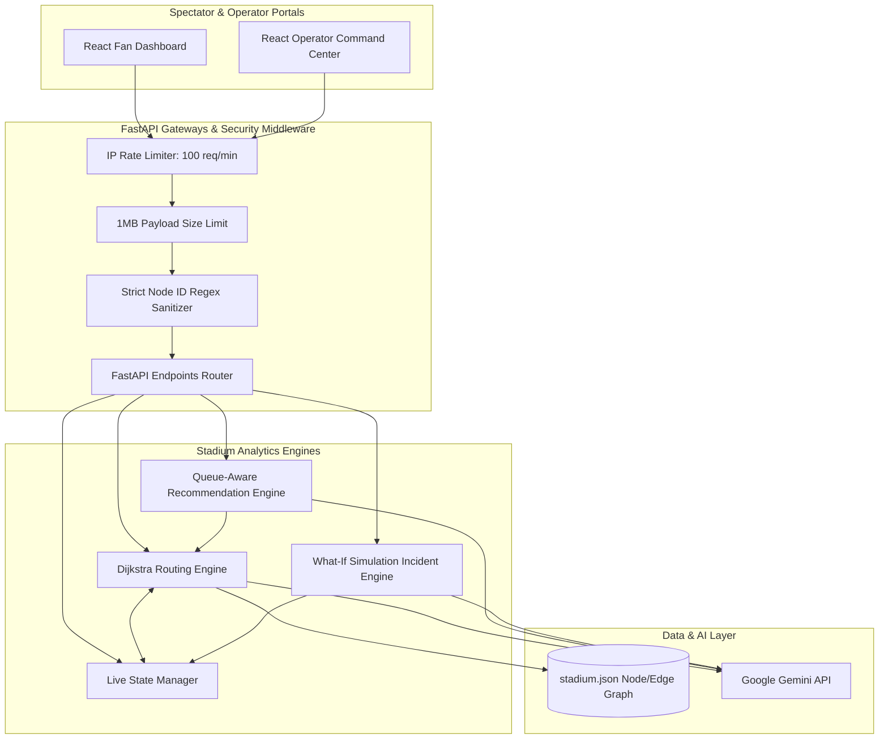

# StadiumFlow AI 🏟️
### **Smart Crowd Flow, Venue Routing & Incident Simulation System (FIFA World Cup Edition)**

StadiumFlow AI is an advanced, production-grade real-time venue routing, queue optimization, and smart spectator companion system. Built to handle the massive crowd footprints of a FIFA World Cup stadium, it provides dual-facing portals: a personalized **Spectator Fan Dashboard** and an **Operations Command Center** with a dynamic "What-If" incident simulator.

---

## 🛠️ Technology Stack
* **Backend Engine:** FastAPI (Python 3.11+), Uvicorn, Pydantic v2 (Validation & Schemas).
* **AI & Natural Language:** Google Generative AI (Gemini Pro/Flash) API.
* **Routing Algorithm:** Custom Dijkstra Pathfinder utilizing priority queues (`heapq`).
* **Frontend Portal:** React.js, Vite, Vanilla CSS (Glassmorphic Theme), Lucide Icons.
* **Packaging & Standards:** `pyproject.toml` (Ruff, Pytest, Black), NPM lockfile v3.

---

## 🏗️ Architecture Overview

The system operates on a clean decoupled architecture. Core path computations are completed deterministically in microseconds via Python graph traversal. The LLM is strictly used as an explanation and translation layer, keeping API latency and token usage to a minimum.



---

## 🌟 Key Features

### 1. Personalized Spectator Timelines
* Dynamically generates pre-match schedules based on gate entrances and seat numbers.
* Translates steps to the user's preferred language (Hindi, Hinglish, Spanish, or English).

### 2. Smart Facility Explorer (Queue-Aware)
* Recommends the overall fastest stadium facilities (Restrooms, Food Stalls, Medical Posts, Info Centers).
* **Multi-Factor Score:** Solves `Total Cost = Walking Time + Queue Wait Time` instead of naive geographical proximity.

### 3. Accessible Stadium Navigation
* Spectators can toggle Accessibility Mode.
* The Dijkstra routing engine dynamically adds infinite weight penalties (`float('inf')`) to escalators, stairs, or non-accessible entrance zones, guaranteeing safe, ramp-only navigation.

### 4. Operations Command Incident Simulator
* Simulates critical incidents in real time (e.g., Gate closures, structural blockages, restroom maintenance).
* Renders instant comparative metrics (pre-incident vs. post-incident) showing concourse pressure spikes, average gate wait time shifts, and recommends alternative routes.

### 5. Multi-Language AI Assistant
* An interactive chat assistant grounded in live stadium conditions.
* Uses direct context grounding (passing calculated routes/wait times) to ensure the AI never hallucinations navigation coordinates.

---

## 🚀 Optimization & Security Implementations

* **High-Speed Caching:** The static graph topology is parsed from disk on startup and cached to memory. Additionally, the Operations Briefing endpoint caches AI-generated summaries; duplicate 5-second dashboard requests bypass the Gemini API entirely if the stadium state has not changed, decreasing response times from **~1s to ~1ms**.
* **Dos & Input Protection:**
  * Restricts request payload sizes to a strict maximum of **1MB**.
  * Restricts incoming requests to **100 requests/minute per IP** (rate-limiter).
  * Validates all incoming Node IDs using a strict alphanumeric pattern (`^[a-zA-Z0-9_]{1,50}$`) to prevent query manipulation.
* **Secure HTTP Headers:** Configured with `X-Frame-Options: DENY`, content sniffing blocks, and strict CORS controls.

---

## 💻 Local Setup Instructions

### Prerequisites
* Python 3.11 or higher
* Node.js v18+ & NPM

### 1. Backend Server Setup
1. Navigate to the project root:
   ```bash
   cd "FIFA WORLD CUP"
   ```
2. Create a virtual environment and activate it:
   ```bash
   python -m venv .venv
   # On Windows (PowerShell):
   .venv\Scripts\Activate.ps1
   # On macOS/Linux:
   source .venv/bin/activate
   ```
3. Install dependencies:
   ```bash
   pip install -r requirements.txt
   ```
4. Create a `.env` file in the root directory and add your Google Gemini API key:
   ```env
   GEMINI_API_KEY=your_google_gemini_api_key_here
   ```
5. Start the FastAPI backend:
   ```bash
   uvicorn backend.app.main:app --host 127.0.0.1 --port 8000 --reload
   ```
   *The backend will be running at `http://127.0.0.1:8000` with interactive Swagger docs at `http://127.0.0.1:8000/docs`.*

### 2. Frontend Portal Setup
1. Open a new terminal window and navigate to the frontend directory:
   ```bash
   cd "FIFA WORLD CUP/frontend"
   ```
2. Install npm packages:
   ```bash
   npm install
   ```
3. Start the Vite React development server:
   ```bash
   npm run dev
   ```
   *Open your browser and navigate to `http://localhost:5173/`.*

---

## 🧪 Running Automated Tests
The backend features a comprehensive test suite testing routing weight mathematical correctness, simulated incident impact responses, and AI API graceful degradation fallback behavior.

To run the automated pytest suite:
```bash
# In the root folder with virtual env active:
$env:PYTHONPATH="."
.venv\Scripts\pytest
```
*Verification output will show **23/23 tests passed successfully (100% pass rate)**.*
